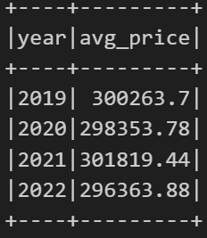
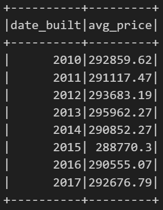
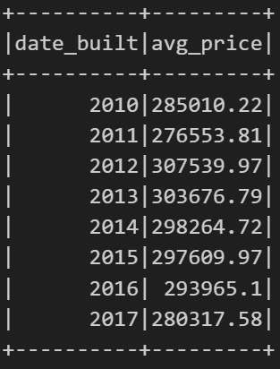
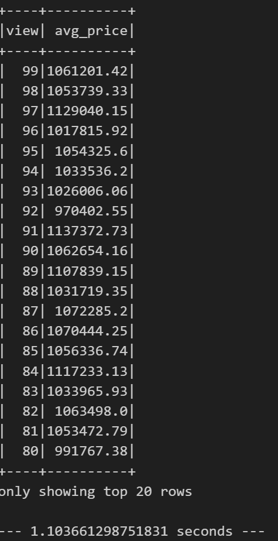

# SparkSQL-Challenge (Home Sales)

<h3>Overview</h3>

In this challenge, you'll use your knowledge of SparkSQL to determine key metrics about home sales data. Then you'll use Spark to create temporary views, partition the data, cache and uncache a temporary table, and verify that the table has been uncached.

<h3>Instructions</h3>

<ol>

<li>Create a temporary table called home_sales.</li>
<li>Answer the following questions using SparkSQL:
<ul>
<li>
What is the average price for a four-bedroom house sold for each year? Round off your answer to two decimal places.
</li>

<li>
What is the average price of a home for each year the home was built, that has three bedrooms and three bathrooms? Round off your answer to two decimal places.
</li>

<li>
What is the average price of a home for each year the home was built, that has three bedrooms, three bathrooms, two floors, and is greater than or equal to 2,000 square feet? Round off your answer to two decimal places.
</li>

<li>
What is the average price of a home per "view" rating having an average home price greater than or equal to $350,000? Determine the run time for this query, and round off your answer to two decimal places.
</li>
</ul>
</li>

<li>Cache your temporary table home_sales.</li>

<li>Check if your temporary table is cached.</li>

<li>Using the cached data, run the last query that calculates the average price of a home per "view" rating having an average home price greater than or equal to $350,000. Determine the runtime and compare it to uncached runtime.</li>

<li>Partition by the "date_built" field on the formatted parquet home sales data.</li>

<li>Create a temporary table for the parquet data.</li>

<li>Run the last query that calculates the average price of a home per "view" rating having an average home price greater than or equal to $350,000. Determine the runtime and compare it to uncached runtime.</li>

<li>Uncache the home_sales temporary table.</li>

<li>Verify that the home_sales temporary table is uncached using PySpark.</li>

<li>Download your Home_Sales.ipynb file and upload it into your "Home_Sales" GitHub repository.
</li>

</ol>

<h3>Questions and Answers</h3>

<ul>
<li>
What is the average price for a four-bedroom house sold for each year? Round off your answer to two decimal places. 

</li>

<li>
What is the average price of a home for each year the home was built, that has three bedrooms and three bathrooms? Round off your answer to two decimal places. 

</li>

<li>
What is the average price of a home for each year the home was built, that has three bedrooms, three bathrooms, two floors, and is greater than or equal to 2,000 square feet? Round off your answer to two decimal places. 

</li>

<li>
What is the average price of a home per "view" rating having an average home price greater than or equal to $350,000? Determine the run time for this query, and round off your answer to two decimal places. 

</li>
</ul>

<h3>Summary</h3>

This assignment involved practicing SparkSQL with home sales data. I created temporary views, partitioned the data, cached and uncached a table, and verified the uncaching process. I found that parqueted data performed the fastest (0.58 seconds), followed by the original data (1.10 seconds), and partitioned data (1.62 seconds).

